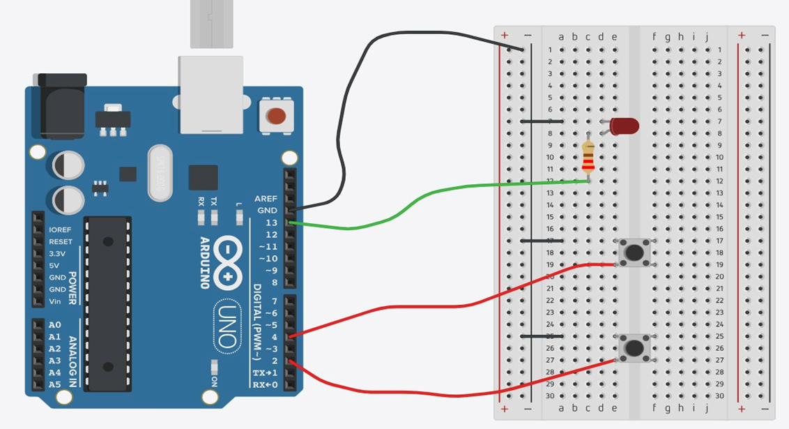

# Arduino LED Button Control

LED control using Arduino UNO with debouncing
and long press prevention.

---

## Task 1 – LED Toggle

By pressing a button once, an LED shall turn on
permanently. By pressing it again, the LED shall
turn off permanently.

**File:** task_a.ino

---

## Task 2 – LED Blink

By pressing a button once, an LED shall blink
permanently (1s on, 1s off). By pressing the
button again, the LED shall turn off permanently.

**File:** task_b.ino

---

## Task 3 – Blink Frequency Switch

By pressing a button once, an LED shall blink
permanently (1s on, 1s off). By pressing the
button again, the LED shall turn off permanently.
The blink frequency shall be switchable via a
second button, between 1s on/off and 2s on/off.

**File:** task_c.ino

---

## Hardware

- Arduino UNO
- LED + 220Ω resistor
- Push button x2
- Breadboard
- 
## Wiring Diagram

## Key Concepts

- Debouncing (50ms)
- Long press prevention
- Non-blocking timing with millis()
- INPUT_PULLUP (no external resistor needed)
